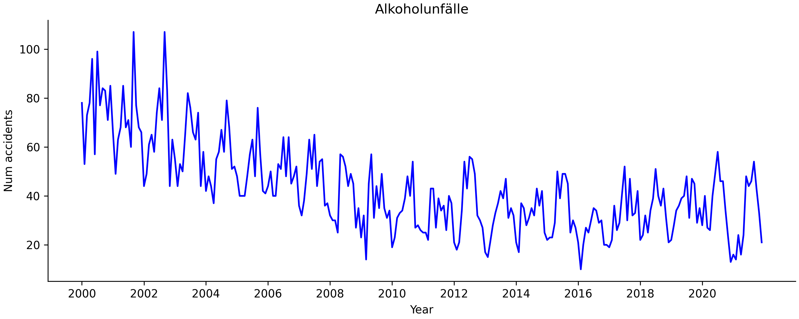
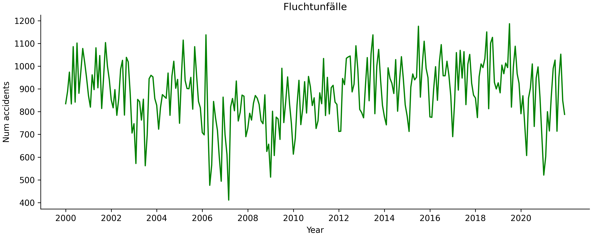
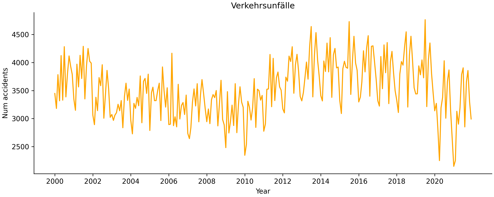
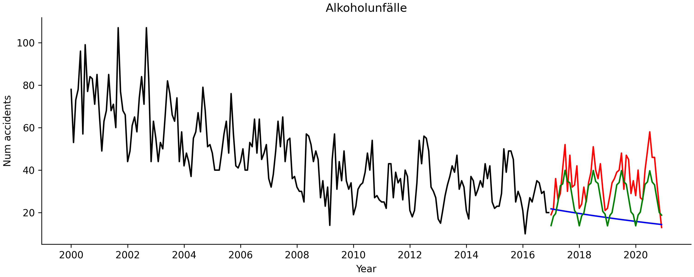

# Time series forecasting of number of accidents in Munich

Visualizing the time series trends of different types of accidents:

## **Alcohol related accidents**

  

## **Escape accidents**

  

## **Road accidents**

  

Using 2 different kinds of autoregressive models, namely Autoregressive Moving Average (ARMA) and 
Autoregressive Integrated Moving Average (ARIMA), we can forecast the number of accidents for the year 2021 from 
data collected during all the previous years. The ARIMA model (green) performed better at predicting the values
than the ARMA model (blue). Ground truth is shown in red.

## **Predictions of alcohol related accidents for the year 2021**

  

